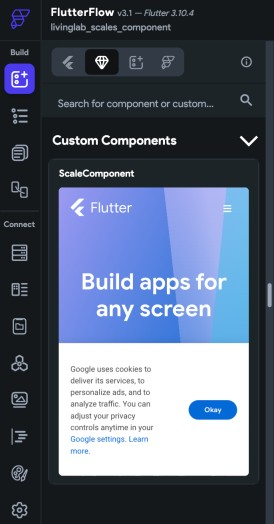
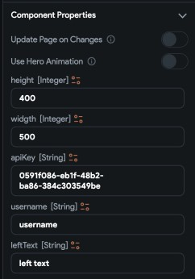
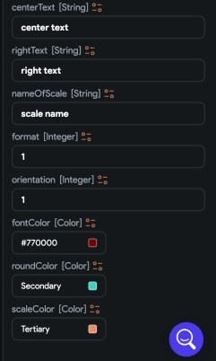

**LivingLab Scale FlutterFlow Component**

Table of Components

[About [1](#about)](#about)

[Flutter Flow Scale component usage
[1](#flutter-flow-scale-component-usage)](#flutter-flow-scale-component-usage)

[First:- Prerequisites
[1](#first--prerequisites)](#first--prerequisites)

[Second: - Usage [2](#second---usage)](#second---usage)

[Third: - Customizing your Scale component
[2](#third---customizing-your-scale-component)](#third---customizing-your-scale-component)

[What you should expect
[5](#what-you-should-expect)](#what-you-should-expect)

# **About**

The Living Lab Scales Component provides a comprehensive set of features
and capabilities to help you effectively use various types of
statistical scales. With these features, you can easily create and
configure NPS scales, Likert scales, Staple scales, Percentage scales,
Percent Sum scales, Guttman scales, and many more.

# **Flutter Flow Scale component usage**

## **First:- Prerequisites**

You will need an Api key to use the component and create a scale
component.

You can find the documentation of the Api from this link

*GitHub link*: <https://github.com/DoWellUXLab/Living-Lab-scale>

You can find a detailed guide on how to get an Api key from this link

*Guide to get Api key link*: <https://bit.ly/43sXMNk>

And you can get your Api key from this link

*Link to the Api key store*: <https://dowellstore.org/>

## **Second: - Usage**

Once you get your Api key you are now ready to use the scale component.

You will find the scale inside the scales tab in FlutterFlow, to use it
you can drag and drop it inside your widget tree wherever you need it.

{width="2.6145833333333335in"
height="5.0in"}

## **Third: - Customizing your Scale component**

You will need to enter your username and your api key first.

After that you will have different options to customize

the scale to your own needs.

{width="3.5104166666666665in"
height="5.0in"}

{width="3.0in"
height="5.0in"}

You can customize the following elements of the scale component

-   The text on the left end of the scale

-   The text at the right end of the scale

-   The text at the center of the scale

-   The height and the width of the component

-   The name for your scale

-   A format for your scale

-   An orientation vertical or horizontal

-   Font color

-   Scale color

-   Round color

When customizing the orientation, you will need to set 1 for horizontal
and 2 for vertical.

When customizing the format of the scale you will need to 1 for numbers,
2 for emoji and 3 for image.

After finishing customizing your scale component you have now a fully
capable and customized scale component

# What you should expect

Below this you will find an example implementation of the Scale
component and what you would see in your app before and after receiving
the responses.

{width="2.3229166666666665in"
height="5.0in"}
{width="2.3125in"
height="5.0in"}
